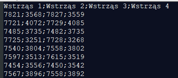
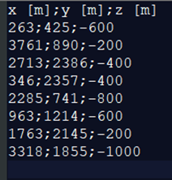
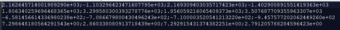
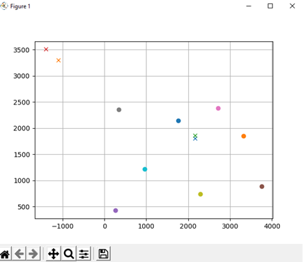

# Lokalizacja Ogniksa wsztrząsu

## **1. Opis problemu:**

Celem ćwiczenia było wyznaczenie współrzędnych ognisk wstrząsów i czasu ich wystąpienia na podstawie współrzędnych stanowisk sejsmograficznych i wejścia czasu danej fali na konkretne stanowisko.

## **2. Sposób rozwiązania**

Linearyzujemy układ równań przez obustronne podniesienie do kwadratu i odjęcie stronami pierwszego równania od wszystkich pozostałych

Tworzymy macierz A zawierającą równania i macierz B zawierającą i rozwiązujemy układ równań

## **3. Ogólny wykonania rozwiązania**

Program rozwiązujący problem został napisane w języku Python 3.8.6.
 Do programu należ wczytać dla pliki .csv ; pierwszy zawierający dane dotyczące 8 stanowisk i drugi zawierający dane dotyczące wstrząsów. Pierwszy plik musi zawierać w wierszach kolejne stanowiska a w kolumnach kolejno współrzędne stanowisk x [m];y [m];z [m] rozdzielone średnikami (Rys 2).Drugi plik musi zawierać w kolumnach kolejne wstrząsy a w wierszach czasy wejścia na dane stanowisko w ms (Rys 1).

_Rysunek 1- Plik z czasami wejścia wstrząsów_

_Rysunek 2-Plik z danymi stanowisk_

Po wczytaniu plików program wykrywa ilość wstrząsów i zamienia czasy wejścia z milisekund na sekundy. Następnie tworzy macierze A i B i rozwiązuje układ równań dla każdego z nich. Program zapisuje rozwiązanie w formie tabeli do pliku wynik.csv gdzie w wierszach znajdują się kolejne wyliczone parametry (x,y,z,t) dla wstrząsu którego numer jest kolumną tej tabeli. Program rysuje także wykres pokazujący położenie stanowisk (kółka) i wstrząsów (X).

_Rysunek 3 Zawartość pliku wyjściowego_

_Rysunek 4 Wykres stworzony przez program_

## **4 . Opis bibliotek i funkcji**

### **4.1. Biblioteki**

Numpy – pozwala na działa na macierzach
 Easygui – umożliwia wybranie plików za pomocą okna dialogowego
 matplolib – umożliwia tworzenie wykresów

### **4.2. Funkcje**

**wczytanie\_stanowisk() , wczytanie\_wstrzasow()** – funkcje wczytują dane z plików i tworzą z nich
 tabele.
**matrixA(s,d,w), matrixA(s,d,w) –** tworzą macierze A i B. s- dane stanowisk, d -dane wstrząsów, w numer liczonego wstrząsu

**wynik(a,b,w) –** rozwiązuje równanie i zapisuje wyniki do tabeli. a- macierz A, b- macierz B, w- numer wstrząsu

**wydruk(tabela\_wyniku,stanowiska)** – zapisuje rozwiązanie do pliku oraz rysuje wykres. tabela\_wyniku **–** tabela zawierająca wynik, stanowiska- dane dotyczące stanowisk.
